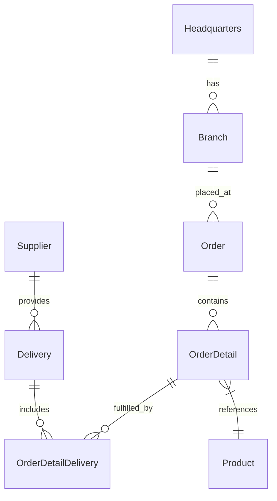

# 🚀 OctoCAT Supply Chain Management System


Welcome to the OctoCAT Supply Chain Management System - showcasing the incredible capabilities of GitHub Copilot, and the power of AI-assisted development!

## ✨ Exercise Overview
This project is designed to demonstrate the potential of GitHub Copilot in a real-world application. 

The OctoCAT Supply Chain Management System is a fully functional web application that allows users to manage orders, deliveries, and suppliers.
It includes a frontend built with React and a backend API built with Express.js. The application is designed to be easy to use and understand, making it perfect for demonstrating the capabilities of GitHub Copilot.

- 🤖 **Copilot Agent Mode & Vision** - Watch Copilot understand UI designs and implement complex features across multiple files
- 🧪 **Test Generation** - Exhibit Copilot's ability to analyze coverage and generate meaningful tests
  
## 🏗️ Architecture

The application is built using modern TypeScript with a clean separation of concerns:



### Tech Stack
- **Frontend**: React 18+, TypeScript, Tailwind CSS, Vite
- **Backend**: Express.js, TypeScript, OpenAPI/Swagger


## 🎯 Key Scenarios

1. **Vibe Coding**
   - Implement a shopping cart from a design mockup
   - Watch Copilot analyze, plan, and implement across multiple files
   - Show real-time UI updates and state management

2. **Automated Testing**
  
   - Create and execute unit tests with intelligent test generation

## 🚀 Getting Started

1. Fork [this](https://github.com/pm-self-learning/octocat-supply-copilot-exercise) repository into your own GitHub account and clone it to your local machine.
   
2. Build the projects:
   ```bash
   # Build API and Frontend
   npm install && npm run build
   ```
3. Start the application:
   ```bash
   npm run dev
   ```

Or use the VS Code tasks:
- `Cmd/Ctrl + Shift + P` -> `Run Task` -> `Build All`
- Use the Debug panel to run `Start API & Frontend`

## Next Steps
Day 1
- Complete the [exercise guide](./docs/exercise.md) for detailed instructions on how to use Copilot features (agent mode)

Day 2
- Complete the [exercise guide](./docs/exercise-day2.md) for detailed instructions on how to use Copilot features (custom instructions, GHCopilot Code Review, and GH Copilot Extensions)


## 📚 Documentation

- [Detailed Architecture](./docs/architecture.md)

## 🎓 Additional Resources


- [Getting Started with GitHub Copilot](https://docs.github.com/en/copilot/getting-started-with-github-copilot)
- [GitHub Copilot Chat Documentation](https://docs.github.com/en/copilot/github-copilot-chat)

- [MS Learn - Training path for GitHub Copilot](https://learn.microsoft.com/en-us/training/modules/introduction-to-github-copilot/)

- [Prompt engineering with GitHub Copilot](https://learn.microsoft.com/en-us/training/modules/introduction-prompt-engineering-with-github-copilot/)
- [Adding repository custom instructions for GitHub Copilot](https://docs.github.com/en/enterprise-cloud@latest/copilot/customizing-copilot/adding-repository-custom-instructions-for-github-copilot)
- [What AI model to use in GitHub Copilot](https://github.blog/ai-and-ml/github-copilot/a-guide-to-deciding-what-ai-model-to-use-in-github-copilot/)
- [Copilot Chat Cookbook](https://docs.github.com/en/copilot/copilot-chat-cookbook)

- [GitHub Copilot Changelog](https://github.blog/changelog/?label=copilot)
- [GitHub YouTube Channel](https://www.youtube.com/@GitHub/videos)


