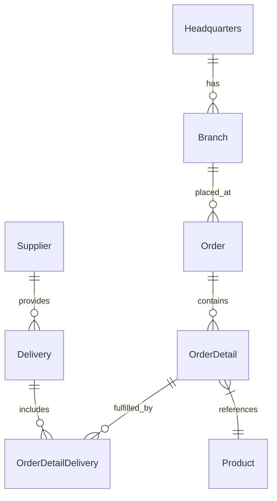

# 🚀 OctoCAT Supply Chain: The Ultimate GitHub Copilot Demo


Welcome to the OctoCAT Supply Chain Management System - your go-to demo for showcasing the incredible capabilities of GitHub Copilot, and the power of AI-assisted development!

## ✨ Exercise Overview
This project is designed to demonstrate the potential of GitHub Copilot in a real-world application. 

The OctoCAT Supply Chain Management System is a fully functional web application that allows users to manage orders, deliveries, and suppliers.
It includes a frontend built with React and a backend API built with Express.js. The application is designed to be easy to use and understand, making it perfect for demonstrating the capabilities of GitHub Copilot.

- 🤖 **Copilot Agent Mode & Vision** - Watch Copilot understand UI designs and implement complex features across multiple files
- 🧪 **Test Generation** - Exhibit Copilot's ability to analyze coverage and generate meaningful tests
- 🛡️ **Security First** - Showcase Copilot-powered vulnerability fixes
  
## 🏗️ Architecture

The application is built using modern TypeScript with a clean separation of concerns:


```mermaid
erDiagram
    Headquarters ||--o{ Branch: has
    Branch ||--o{ Order: placed_at
    Order ||--o{ OrderDetail: contains
    OrderDetail ||--o{ OrderDetailDelivery: fulfilled_by
    OrderDetail }|--|| Product: references
    Delivery ||--o{ OrderDetailDelivery: includes
    Supplier ||--o{ Delivery: provides
```

### Tech Stack
- **Frontend**: React 18+, TypeScript, Tailwind CSS, Vite
- **Backend**: Express.js, TypeScript, OpenAPI/Swagger


## 🎯 Key Scenarios

1. **Vibe Coding**
   - Implement a shopping cart from a design mockup
   - Watch Copilot analyze, plan, and implement across multiple files
   - Show real-time UI updates and state management

2. **Automated Testing**
   - Generate BDD feature files
   - Create and execute tests
   - Enhance unit test coverage with intelligent test generation

3. **Security and Best Practices**
   - Implement security best practices with Copilot guidance


## 🚀 Getting Started

1. Clone this repository
2. Build the projects:
   ```bash
   # Build API and Frontend
   npm install && npm run build
   ```
3. Start the application:
   ```bash
   npm run dev
   ```

Or use the VS Code tasks:
- `Cmd/Ctrl + Shift + P` -> `Run Task` -> `Build All`
- Use the Debug panel to run `Start API & Frontend`

## Next Steps
- Complete the [exercise guide](./docs/exercise.md) for detailed instructions on how to use Copilot features
## 📚 Documentation

- [Detailed Architecture](./docs/architecture.md)

