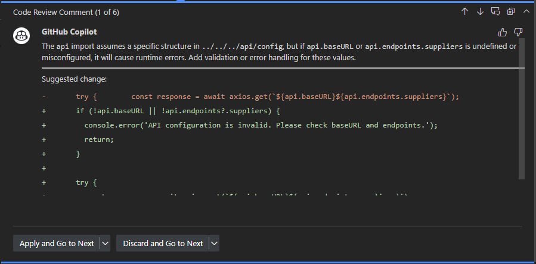

# **GitHub Copilot Customization Exercise**

This exercise will show you how to customize GitHub Copilot to improve its code generation capabilities by using instruction files and prompt files.

## **Features to Learn**

- **Instruction Files**: Create and use instruction files to define coding standards and project requirements


## **Description**

- **About the Exercise**: Learn how to make GitHub Copilot follow your coding practices and standards using custom instructions.
- **Why**: Standardize Copilot's output across your team, improve code quality, and ensure consistency.

## **Prerequisites**

- GitHub Copilot extension installed and activated in VS Code
- Basic understanding of VS Code settings

## **Getting Started**

Ensure you have the GitHub Copilot extension installed and configured in VS Code before starting the exercise.

## **Exercise 1: Setting Up an Instruction File**

### **What You'll Learn**
Create a `.github/copilot-instructions.md` file to define project-wide coding standards for GitHub Copilot.

### **Steps**:

1. First, ensure [instruction files](vscode://settings/github.copilot.chat.codeGeneration.useInstructionFiles) are enabled in VS Code settings:
    
   
2. Create a `.github` directory at the root of your workspace if it doesn't exist.


3. Create a `copilot-instructions.md` file in the `.github` directory:

4. Copy the contents from [sample](../docs/sample-copilot-instructions.md) into your `copilot-instructions.md` file under the `.github` directory, and save it.

5. Test your instruction file by implementing a new feature with Copilot's help:
   - Open Copilot Chat, and select `Agent` mode. Use the following prompt:
     ```txt
     Create a new "Suppliers" feature that adds a suppliers link to the navigation bar and displays a list of suppliers fetched from the backend. The list should include the supplier name, and contact information
     ```
   - Review the generated code to verify it follows the instructions in your copilot-instructions.md file. `copilot-instructions.md` file should get included automatically in the prompt.
    

   - Test the feature in your application
   - Once you are happy with the changes, click `Keep` to accept the changes and add them to your codebase.

## **Exercise 2: GitHub Copilot Code Review**

### **What You'll Learn**
Learn how to use GitHub Copilot to review your code changes and get AI-powered suggestions for improvements in VS Code.

### **Steps**:

1. Select the `Suppliers.tsx` file generated by Copilot in the exercise above.

3. Try reviewing a code selection:
   - Select a portion of code you want to review or the entire file
   - Open the **Command Palette** (Ctrl+Shift+P or Cmd+Shift+P)
   - Search for and select `GitHub Copilot: Review and Comment`
   - Wait for Copilot to review your code (usually takes less than 30 seconds)
   - Review Copilot's inline comments and suggestions in your file

     - Copilot will provide suggestions for improvements, such as:
          - Code quality improvements
          - Performance improvements
          - Bug fixes
          - Security vulnerabilities
   
  4. Working with suggestions:
      - Click `Apply and Go To Next` to accept a suggestion
      - Click `Discard and Go to Next` to reject a suggestion
  
        


   5. You can try out the `GitHub Copilot: Review and Comment` command on any other file in your codebase to see how Copilot reviews the code.
      
   6.  Once you are happy with the changes, test the feature in your application to ensure it works as expected and commit the changes to your codebase. 

### **Important Tips**

1. **Validation**: 
   - Always validate Copilot's feedback carefully
   - Supplement Copilot's review with human review
   - Remember that Copilot isn't guaranteed to spot all issues

2. **Language Support**:
   - Full support for: C, C#, C++, Go, Java, JavaScript, Kotlin, Markdown, Python, Ruby, Swift, TypeScript
   - Public preview support for: HTML and Text

3. **Feedback**:
   - Provide feedback using thumbs up/down buttons on comments
   - Your feedback helps improve the quality of suggestions


## **Key Takeaways**

- **Custom Instructions**: GitHub Copilot can follow your coding standards and project requirements when provided with clear instructions.
- **Reusable Prompts**: Create prompt files for common tasks to standardize code generation across your team.
- **Improved Code Quality**: Properly configured, Copilot can generate code that follows your team's best practices.

- **AI-Powered Code Review**: GitHub Copilot can provide immediate feedback on your code changes, helping catch issues early.

## **Next Steps**

- Create instruction files and prompt files for different parts of your codebase. Refer to the below article for more details:
  - [GitHub Copilot: Custom Instructions](https://docs.github.com/en/enterprise-cloud@latest/copilot/customizing-copilot/adding-repository-custom-instructions-for-github-copilot)
- Share your instruction files with your team
- Create a library of prompt files for common tasks
- Experiment with different combinations of instructions and prompts
- For more on GitHub Copilot Code Review, refer to the [GitHub Copilot Code Review documentation](https://docs.github.com/en/copilot/using-github-copilot/code-review/using-copilot-code-review?tool=vscode)
