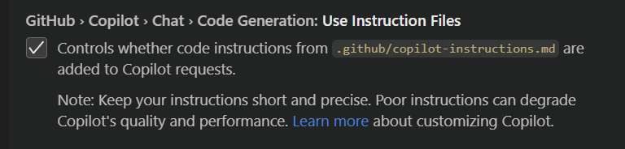
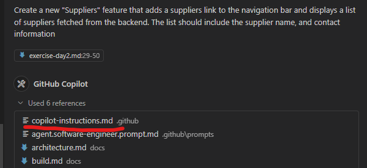

# **GitHub Copilot Customization Exercise**

This exercise will show you how to customize GitHub Copilot to improve its code generation capabilities by using instruction files and prompt files.

## **Features to Learn**

- **Instruction Files**: Create and use instruction files to define coding standards and project requirements


## **Description**

- **About the Exercise**: Learn how to make GitHub Copilot follow your coding practices and standards using custom instructions.
- **Why**: Standardize Copilot's output across your team, improve code quality, and ensure consistency.

## **Prerequisites**

- GitHub Copilot extension installed and activated in VS Code
- Basic understanding of VS Code settings

## **Getting Started**

Ensure you have the GitHub Copilot extension installed and configured in VS Code before starting the exercise.

## **Exercise 1: Setting Up an Instruction File**

### **What You'll Learn**
Create a `.github/copilot-instructions.md` file to define project-wide coding standards for GitHub Copilot.

### **Steps**:

1. First, ensure [instruction files](vscode://settings/github.copilot.chat.codeGeneration.useInstructionFiles) are enabled in VS Code settings:
    
   
2. Create a `.github` directory at the root of your workspace if it doesn't exist.


3. Create a `copilot-instructions.md` file in the `.github` directory:

4. Copy the contents from [sample](../docs/sample-copilot-instructions.md) into your `copilot-instructions.md` file under the `.github` directory, and save it.

5. Test your instruction file by implementing a new feature with Copilot's help:
   - Open Copilot Chat, and select `Agent` mode. Use the following prompt:
     ```txt
     Create a new "Suppliers" feature that adds a suppliers link to the navigation bar and displays a list of suppliers fetched from the backend. The list should include the supplier name, and contact information
     ```
   - Review the generated code to verify it follows the instructions in your copilot-instructions.md file. `copilot-instructions.md` file should get included automatically in the prompt.
    

   - Test the feature in your application


## **Key Takeaways**

- **Custom Instructions**: GitHub Copilot can follow your coding standards and project requirements when provided with clear instructions.
- **Reusable Prompts**: Create prompt files for common tasks to standardize code generation across your team.
- **Improved Code Quality**: Properly configured, Copilot can generate code that follows your team's best practices.

## **Next Steps**

- Create instruction files for different parts of your codebase. Refer to the below article for more details:
  - [GitHub Copilot: Custom Instructions](https://docs.github.com/en/enterprise-cloud@latest/copilot/customizing-copilot/adding-repository-custom-instructions-for-github-copilot)
- Share your instruction files with your team
- Create a library of prompt files for common tasks
- Experiment with different combinations of instructions and prompts
